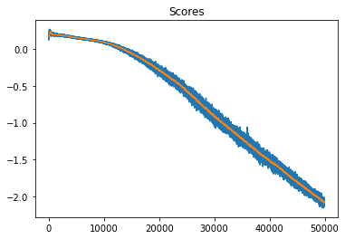
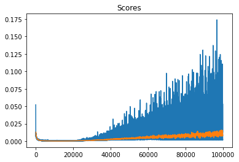

[//]: # (Image References)

[image1]: https://user-images.githubusercontent.com/10624937/43851024-320ba930-9aff-11e8-8493-ee547c6af349.gif "Trained Agent"
[image2]: https://user-images.githubusercontent.com/10624937/43851646-d899bf20-9b00-11e8-858c-29b5c2c94ccc.png "Crawler"
[image3]: https://nervanasystems.github.io/coach/_images/td3.png
[image4]: https://nervanasystems.github.io/coach/_images/ddpg.png


# Project 2: Continuous Control

### Introduction

For this project, you will work with the [Reacher](https://github.com/Unity-Technologies/ml-agents/blob/master/docs/Learning-Environment-Examples.md#reacher) environment.

![Trained Agent][image1]

In this environment, a double-jointed arm can move to target locations. A reward of +0.1 is provided for each step that the agent's hand is in the goal location. Thus, the goal of your agent is to maintain its position at the target location for as many time steps as possible.

The observation space consists of 33 variables corresponding to position, rotation, velocity, and angular velocities of the arm. Each action is a vector with four numbers, corresponding to torque applicable to two joints. Every entry in the action vector should be a number between -1 and 1.

### Distributed Training

For this project, we will provide you with two separate versions of the Unity environment:
- The first version contains a single agent.
- The second version contains 20 identical agents, each with its own copy of the environment.  

The second version is useful for algorithms like [PPO](https://arxiv.org/pdf/1707.06347.pdf), [A3C](https://arxiv.org/pdf/1602.01783.pdf), and [D4PG](https://openreview.net/pdf?id=SyZipzbCb) that use multiple (non-interacting, parallel) copies of the same agent to distribute the task of gathering experience.  

### Solving the Environment

Note that your project submission need only solve one of the two versions of the environment. 

#### Option 1: Solve the First Version

The task is episodic, and in order to solve the environment,  your agent must get an average score of +30 over 100 consecutive episodes.

#### Option 2: Solve the Second Version

The barrier for solving the second version of the environment is slightly different, to take into account the presence of many agents.  In particular, your agents must get an average score of +30 (over 100 consecutive episodes, and over all agents).  Specifically,
- After each episode, we add up the rewards that each agent received (without discounting), to get a score for each agent.  This yields 20 (potentially different) scores.  We then take the average of these 20 scores. 
- This yields an **average score** for each episode (where the average is over all 20 agents).

The environment is considered solved, when the average (over 100 episodes) of those average scores is at least +30. 

### Getting Started

1. Download the environment from one of the links below.  You need only select the environment that matches your operating system:

    - **_Version 1: One (1) Agent_**
        - Linux: [click here](https://s3-us-west-1.amazonaws.com/udacity-drlnd/P2/Reacher/one_agent/Reacher_Linux.zip)
        - Mac OSX: [click here](https://s3-us-west-1.amazonaws.com/udacity-drlnd/P2/Reacher/one_agent/Reacher.app.zip)
        - Windows (32-bit): [click here](https://s3-us-west-1.amazonaws.com/udacity-drlnd/P2/Reacher/one_agent/Reacher_Windows_x86.zip)
        - Windows (64-bit): [click here](https://s3-us-west-1.amazonaws.com/udacity-drlnd/P2/Reacher/one_agent/Reacher_Windows_x86_64.zip)

    - **_Version 2: Twenty (20) Agents_**
        - Linux: [click here](https://s3-us-west-1.amazonaws.com/udacity-drlnd/P2/Reacher/Reacher_Linux.zip)
        - Mac OSX: [click here](https://s3-us-west-1.amazonaws.com/udacity-drlnd/P2/Reacher/Reacher.app.zip)
        - Windows (32-bit): [click here](https://s3-us-west-1.amazonaws.com/udacity-drlnd/P2/Reacher/Reacher_Windows_x86.zip)
        - Windows (64-bit): [click here](https://s3-us-west-1.amazonaws.com/udacity-drlnd/P2/Reacher/Reacher_Windows_x86_64.zip)
    
    (_For Windows users_) Check out [this link](https://support.microsoft.com/en-us/help/827218/how-to-determine-whether-a-computer-is-running-a-32-bit-version-or-64) if you need help with determining if your computer is running a 32-bit version or 64-bit version of the Windows operating system.

    (_For AWS_) If you'd like to train the agent on AWS (and have not [enabled a virtual screen](https://github.com/Unity-Technologies/ml-agents/blob/master/docs/Training-on-Amazon-Web-Service.md)), then please use [this link](https://s3-us-west-1.amazonaws.com/udacity-drlnd/P2/Reacher/one_agent/Reacher_Linux_NoVis.zip) (version 1) or [this link](https://s3-us-west-1.amazonaws.com/udacity-drlnd/P2/Reacher/Reacher_Linux_NoVis.zip) (version 2) to obtain the "headless" version of the environment.  You will **not** be able to watch the agent without enabling a virtual screen, but you will be able to train the agent.  (_To watch the agent, you should follow the instructions to [enable a virtual screen](https://github.com/Unity-Technologies/ml-agents/blob/master/docs/Training-on-Amazon-Web-Service.md), and then download the environment for the **Linux** operating system above._)

2. Place the file in the DRLND GitHub repository, in the `p2_continuous-control/` folder, and unzip (or decompress) the file. 

### Instructions

Open `Continuous_Control.ipynb` to get started with the example with 20 agents I have implemeneted

1.	Define the Network:
- TD3 was used in this agent, Twin Delayed Deep Deterministic policy gradient in this practice [1], since it significantly improves the training performance compare to vanila DDPG: Better convergence in small network and much faster, got 30+ around 100 episodes.
- Network size:
<br>As the Vector Observation space size in this environment is 33, action space size is 4.
<br>I have defined First hidden layer units as 256 and 2nd hidden layer as 64 for Actor, small enough to run in CPU with balance of simplicity and efficiency.
<br>For the Critic First hidden layer units as 128 and 2nd hidden layer as 32, which the similar size as the one in my Navigation project with DDQN.
<br>And Critic in TD3 has 2 heads Q1 and Q2, which have identical layers

![TD3][image3] |  ![DDPG][image4]
:-------------------------:|:-------------------------:
TD3            |  vanila DDPG

2.	Define the Replay Buffer:
    <p> Make a deque for memorizing episode, size is very large, 1e5 or 1e6
    <p> In each step of the episodes, the information of the 20 agents will be saved to the buffer, includes: State and next State of each agent, action, reward and done. 
    <p> Sample randomly from the buffer in each training step, provided it has sufficient items
    <p> In fact 20 Agent provides much more samples, so converge could be quite faster than 1 agent only.

3.	Define the Agent:
    <p> Since TD3 is off-policy learning, I need to define 2 set of Networks: local and target, the local network will used for generating actions, and the target network will be used as updating the policy
    <p> TD3 concurrently learns two Q-functions, Q1 and Q2, by mean square Bellman error minimization, in almost the same way that DDPG learns its single Q-function
    <p> In TD3, there is a delaying policy update, which makes TD3 special [1], it will soft update the target network every D steps, D=2 in my case. Soft update is a special way in TD3/DDPG, rather copy the whole local to target, the soft update the new target with 
    
    > θ_t = 𝛕 * θ_t + (1-𝛕) * θ
    
    <p> Exploration, in TD3, I did not use epsilon-greedy, refer to sfujim’s implementation [3], I also use a random in the beginning of each episode, and then add a small noise afterward to maintain the stochastic
    Also, when generate next action with actor target, TD3 will add a nomralized noise clip as well.

4.	Training the DDQN:
    <p> Due to the Network is small, and most time was consumed in the simulator, it didn’t make much difference in CPU and GPU, sometimes it can reach 30+ less than 100 episodes, and sometimes ~150 episodes.
    <p> Max_Steps: 1001 as observed in the env, it will be finished in 1001
    <p> Skip_timesteps, 50, mean it will randomly generate actions at the first 50 steps beginning of each episode.
    <p> Random action generation, I made a test before the training, random normal distribution would get more score (0.4+) than random equal distribution (0.2-)
    <p> Batch_size, 128 or 256, 256 is better in convergence.
    
```
Episode 10	Average Score: 1.10
Episode 20	Average Score: 5.73
Episode 30	Average Score: 17.67
Episode 40	Average Score: 26.48
Episode 50	Average Score: 31.21
Episode 60	Average Score: 32.64
Episode 70	Average Score: 33.25
Episode 80	Average Score: 35.85
Finished at Episode 84	Reach Average Score: 36.03!
```

    
5.	Interesting observations:
    <p>It is very strange that critic loss would keep increasing after a period, though the actor loss keeps reducing. I have searched online, seems quite common in DDPG, but mine is creasing so significant, would like to understand more about it.

 |  
:-------------------------:|:-------------------------:
actor loss            |  critc loss


### (Additional) Challenge: Crawler 
![Crawler][image2]
In this continuous control environment, the goal is to teach a creature with four legs to walk forward without falling.

You can read more about this environment in the ML-Agents GitHub [here](https://github.com/Unity-Technologies/ml-agents/blob/master/docs/Learning-Environment-Examples.md#crawler).  To solve this harder task, you'll need to download a new Unity environment.  (**Note**: Udacity students should not submit a project with this new environment.)

You need only select the environment that matches your operating system:
- Linux: [click here](https://s3-us-west-1.amazonaws.com/udacity-drlnd/P2/Crawler/Crawler_Linux.zip)
- Mac OSX: [click here](https://s3-us-west-1.amazonaws.com/udacity-drlnd/P2/Crawler/Crawler.app.zip)
- Windows (32-bit): [click here](https://s3-us-west-1.amazonaws.com/udacity-drlnd/P2/Crawler/Crawler_Windows_x86.zip)
- Windows (64-bit): [click here](https://s3-us-west-1.amazonaws.com/udacity-drlnd/P2/Crawler/Crawler_Windows_x86_64.zip)

Then, place the file in the `p2_continuous-control/` folder in the DRLND GitHub repository, and unzip (or decompress) the file.  Next, open `Crawler.ipynb` and follow the instructions to learn how to use the Python API to control the agent.

(_For AWS_) If you'd like to train the agent on AWS (and have not [enabled a virtual screen](https://github.com/Unity-Technologies/ml-agents/blob/master/docs/Training-on-Amazon-Web-Service.md)), then please use [this link](https://s3-us-west-1.amazonaws.com/udacity-drlnd/P2/Crawler/Crawler_Linux_NoVis.zip) to obtain the "headless" version of the environment.  You will **not** be able to watch the agent without enabling a virtual screen, but you will be able to train the agent.  (_To watch the agent, you should follow the instructions to [enable a virtual screen](https://github.com/Unity-Technologies/ml-agents/blob/master/docs/Training-on-Amazon-Web-Service.md), and then download the environment for the **Linux** operating system above._)
